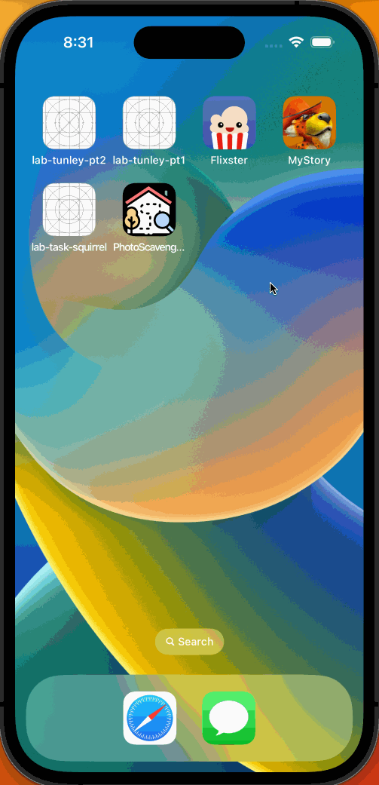
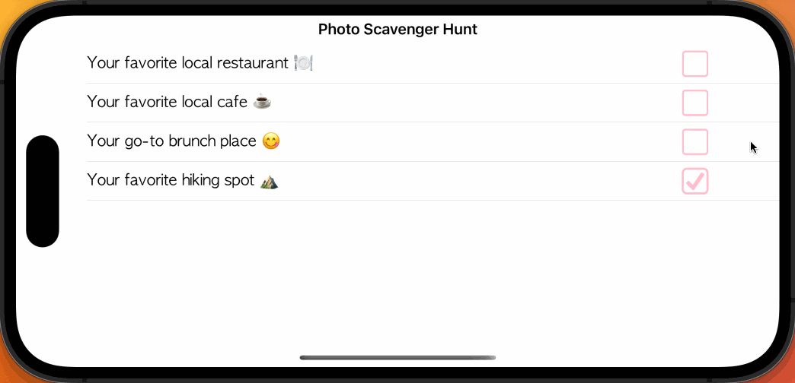

# Project 4 - *Photo Scavenger Hunt*

Submitted by: **Kelly Bonilla Guzman**

**Photo Scavenger Hunt** is an app that has a list which requires the user to attach photos based on the task. After attaching
the photo to a task, the app shows the user where that photo was taken in a map.

Time spent: **3** hours spent in total

## Required Features

The following **required** functionality is completed:

- [X] App displays list of hard-coded tasks
- [X] When a task is tapped it navigates the user to a task detail view
- [X] When user adds photo to complete the tasks, it marks the task as complete
- [X] When adding photo of task, the location is added
- [X] User returns to home page (list of tasks) and the status of your task is updated to complete
 
The following **optional** features are implemented:

- [ ] User can launch camera to snap a picture	

## Video Walkthrough

Here's a walkthrough of implemented user stories:

<!-- Replace this with whatever GIF tool you used! -->
GIF created with LICEcap  
<!-- Recommended tools:
[Kap](https://getkap.co/) for macOS
[ScreenToGif](https://www.screentogif.com/) for Windows
[peek](https://github.com/phw/peek) for Linux. -->

## Notes

During this project, I encountered challenges with updating the status of my tasks to complete. Initially, I was unsure how to
approach implementing this feature, and thus, I read through documentation to understand how to pass in photos to view controllers
when added to a project's assets. From there, I began to logic my way through this implementation, realizing that my custom data
model has a property that updates whenever a task is/isn't complete. Specifically, I incorporated if statement logic that passed in
the photo that correspond with the task in order for my app's tasks' status to update.

## License

    Copyright 2023 Kelly Bonilla Guzman

    Licensed under the Apache License, Version 2.0 (the "License");
    you may not use this file except in compliance with the License.
    You may obtain a copy of the License at

        http://www.apache.org/licenses/LICENSE-2.0

    Unless required by applicable law or agreed to in writing, software
    distributed under the License is distributed on an "AS IS" BASIS,
    WITHOUT WARRANTIES OR CONDITIONS OF ANY KIND, either express or implied.
    See the License for the specific language governing permissions and
    limitations under the License.
